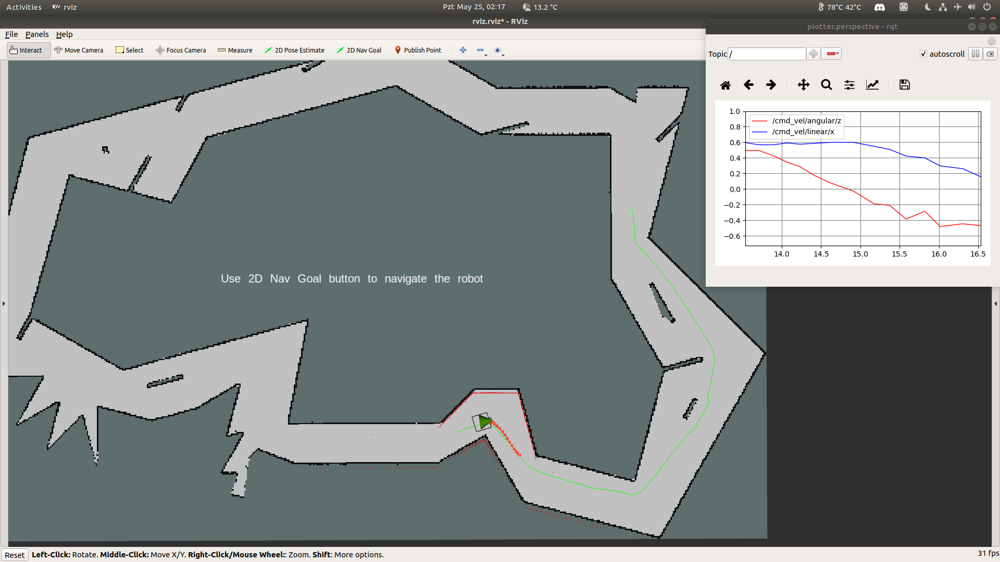

# Deep Navigation

[TOC]

## 1. Introduction




## 2. Installation

1. Install `ROS Melodic (or Kinetic)` and `Anaconda3`:

   - You can install these libraries by yourself or using this installer: https://github.com/salihmarangoz/All-in-One-Installer
   
2. Install `ROS-Python3` required libraries:

   ```bash
   $ sudo apt install python3-pip python3-yaml
   $ sudo pip3 install rospkg catkin_pkg
   ```

3. Clone the repository into `~/catkin_ws/src` folder and build the workspace:

   ```bash
   $ cd ~/catkin_ws/src
   $ git clone https://github.com/salihmarangoz/deep_navigation
   $ cd ..
   $ rosdep install --from-paths src --ignore-src -r -y
   $ catkin build --cmake-args -DCMAKE_BUILD_TYPE=RelWithDebInfo
   ```

4. Modify file `deep_navigation/scripts/deep_navigation_node.py` and `deep_navigation/scripts/create_dataset.py` correctly to import Anaconda3 and ROS at the same time. Run the following commands and modify these files according to the outputs.

   ```bash
   $ source activate YOUR_CONDA_ENV_HERE; which python # modify line 1
   $ pip3 show rospkg | grep Location # modify line 3
   ```


## 3. Running

```bash
$ source /opt/ros/melodic/setup.bash; source ~/catkin_ws/devel/setup.bash
$ roscore
```

1. **For creating a dataset:**

   ```bash
   # Each in different terminal. Do not forget to source ros setup.bash files
   $ roslaunch deep_navigation simulation.launch
   $ roslaunch deep_navigation create_dataset.launch
   $ roslaunch deep_navigation ros_navigation.launch
   ```

2. **For training the network:**

    - `notebooks/example.ipynb` (with jupyter notebook)

3. **For running the network:**

   ```bash
   # Each in different terminal. Do not forget to source ros setup.bash files
   $ roslaunch deep_navigation simulation.launch
   $ roslaunch deep_navigation deep_navigation.launch
   ```


## 4. Designing a World

1. Run gazebo:

```bash
$ gazebo
```

2. In the gazebo gui: `Edit` -> `Building Editor`
3. After building your world save the design into `models` in this repository.
4. In `world` folder, copy `deep_parkour.world`, modify line **14** (change deep_parkour to your worlds model name)
5. In `simulation.launch` set `start_fake_mapping` to false for enabling mapping. Also set `world_file` to its new value.
6. Run `simulation.launch` and `ros_navigation.launch` for exploring whole world.
7. After mapping the world, save the map with the following command:

```bash
$ rosrun map_server map_saver # Files may be saved into home folder
```

8. Copy the map files into `world` folder, and in `simulation.launch` modify `map_file` parameter and also set `start_fake_mapping` to true again.
9. Rename files and then modify the first line of `.yaml` file.
10. Done.


## 5. Simulator Parameters

### 5.1. Lidar Model

Modify file`deep_navigation/models/custom_p3at/model.sdf`

```xml
<ray>
  <scan>
    <horizontal>
    <samples>360</samples>          <!-- 1040!!! -->
    <resolution>2</resolution>
    <min_angle>-3.14</min_angle> <!-- 90deg: -1.570796 -->
    <max_angle>3.14</max_angle>  <!-- 90deg: 1.570796  -->
    </horizontal>
  </scan>
  <range>
    <min>0.08</min>
    <max>20.0</max>
    <resolution>0.01</resolution>
  </range>
  <noise>
  <type>gaussian</type>
      <mean>0.01</mean>
      <stddev>0.005</stddev>
  </noise>
</ray>
```

### 5.2. Simulator Speed

Modify file `deep_navigation/worlds/custom.world`

For parameter `real_time_update_rate`:

- 1000 is real world time.
- 2000 is 2x faster.
- 5000 is 5x faster... and so on.

```xml
<!-- Simulator -->
<physics name="ode_100iters" type="ode">
  <real_time_update_rate>1000</real_time_update_rate>
  <ode>
    <solver>
      <type>quick</type>
      <iters>100</iters>
    </solver>
  </ode>
</physics>
```

